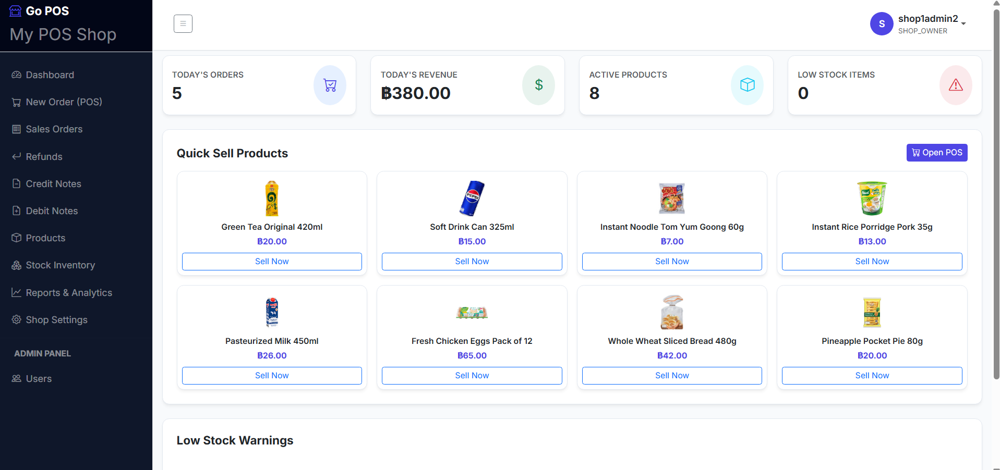
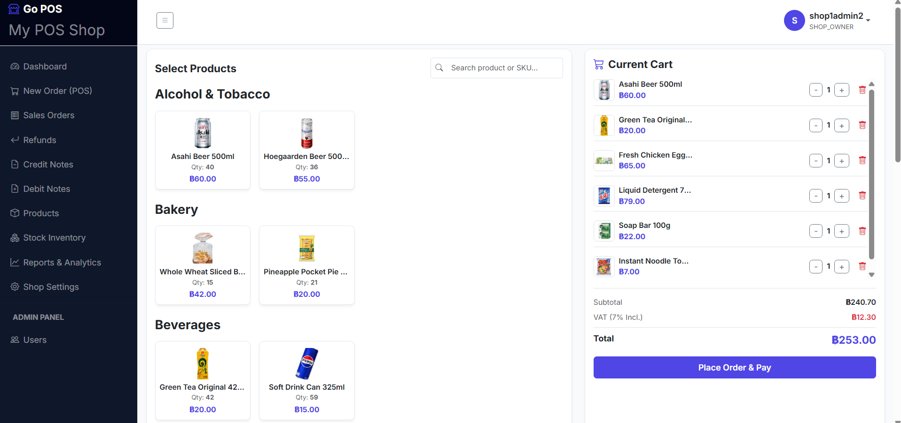
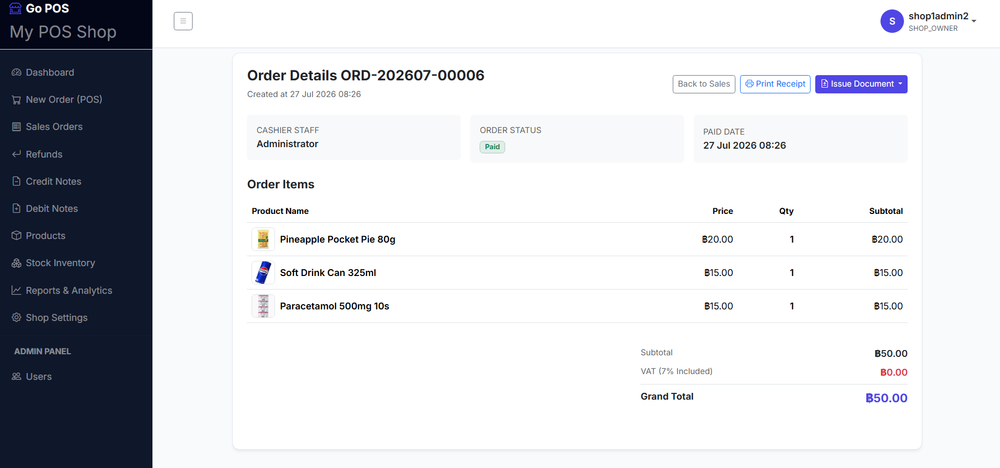
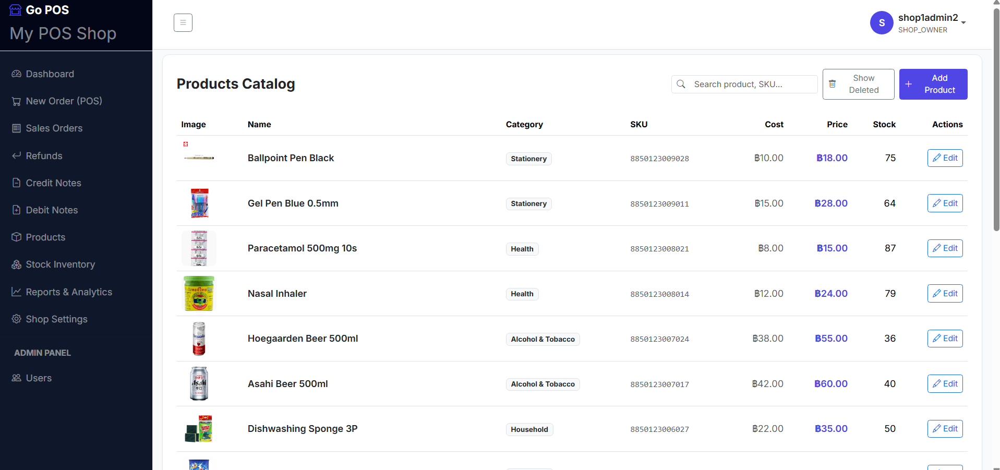
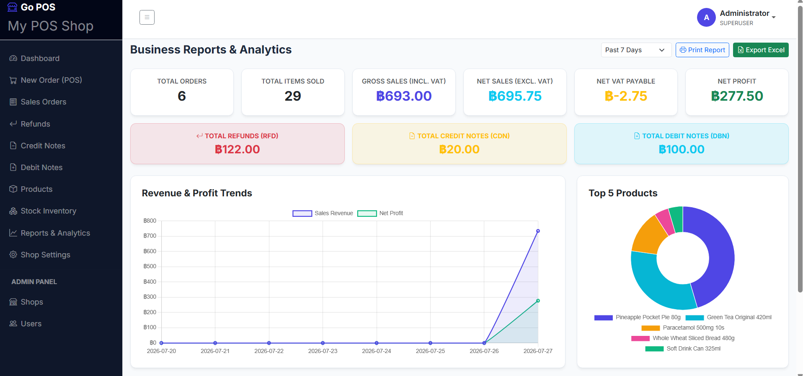
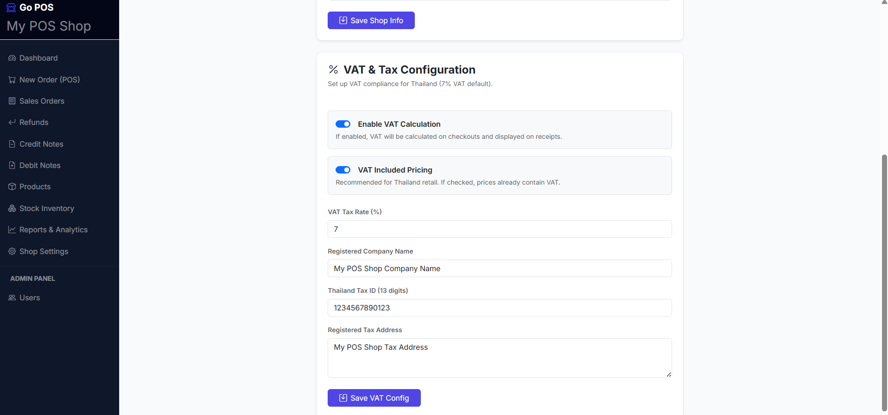

# Go POS - Modern Point of Sale System

A full-featured, lightweight, and modern multi-tenant Point of Sale (POS) system built with Go, Gin, GORM, SQLite, and Bootstrap 5.








## Features

- **Point of Sale (POS)**: Fast checkout interface grouped by product categories with live text search, dynamic cart calculations, custom VAT rate support, and instant receipt generation.
- **Products Catalog**: Full product management with categories (Beverages, Snacks, Dairy, Bakery, Personal Care, Household, Alcohol & Tobacco, Health, Stationery, Other), custom per-product VAT rates & exemptions, image uploads, cost/selling price tracking, and real-time client-side search filtering.
- **Stock Inventory Management**: Track current inventory stock levels, perform manual stock adjustments/restocking with modal controls, and audit full stock movement logs.
- **Sales Orders & Document History**: Complete management of Sales Orders, Refunds (RFD), Credit Notes (CDN), and Debit Notes (DBN) with custom monthly document running numbers.
- **VAT & Tax System**: Multi-tenant shop-level VAT configuration (VAT-inclusive / VAT-exclusive, tax ID, business address) plus per-product custom VAT rates and VAT exempt flags.
- **Business Reports & Analytics**: Interactive revenue, profit trends, item sales summaries, low-stock warnings, print-ready formal reports, and multi-sheet Excel (`.xlsx`) exports (including 11 detailed breakdown sheets for tax submission).
- **Multi-Tenant & Role-Based Access**: Multi-shop management with Superuser, Shop Owner, Manager, and Cashier role permissions.
- **Automated Mock Data Seeding**: Built-in environment-driven mock dataset (`MOCK_DATA=1`) with products, images, categories, and initial inventory stock audit logs.

## Tech Stacks

- **Backend**: Go 1.26+, Gin Web Framework
- **Database & ORM**: SQLite, GORM ORM
- **Authentication & Validation**: JWT / Session auth, Go-Playground Validator
- **Frontend / Styling**: HTML5, Vanilla JavaScript, Bootstrap 5, Bootstrap Icons, Chart.js
- **Excel Export Engine**: `github.com/xuri/excelize/v2`

## How to Use

### Prerequisites

- Go 1.22 or higher installed

### Getting Start

1. **Clone the repository**:
   ```bash
   git clone https://github.com/dreamoutbox/go-pos.git
   cd go-pos
   ```

2. **Run with Development Script**:
   ```bash
   ./dev.sh
   ```
   Or run directly with mock data enabled:
   ```bash
   export MOCK_DATA=1
   go run main.go
   ```

3. **Access Application**:
   Open [http://localhost:8080](http://localhost:8080) in your browser.

4. **Default Credentials**:
   - **Username**: `admin@pos.local`
   - **Password**: `admin`

## How to Contribute This Project

We welcome contributions from the community! Here is how you can help develop and improve Go POS:

### Development Workflow

1. **Fork & Branch**: Fork the repository and create a feature branch (`git checkout -b feature/amazing-feature`).
2. **Local Testing**: Run the server using `./dev.sh` and make sure code builds cleanly (`go build ./...`).
3. **Coding Standards**:
   - Follow standard Go project layout and conventions.
   - Keep templates clean and ensure template comparisons are safe.
   - Re-use shared frontend logic in `static/js/app.js`.
4. **Submit a Pull Request**: Push your branch and open a Pull Request with a clear summary of your changes.

### Reporting Issues & Suggestions

Feel free to open an Issue on GitHub for bug reports, UI enhancements, tax calculation feature requests, or new module proposals.
